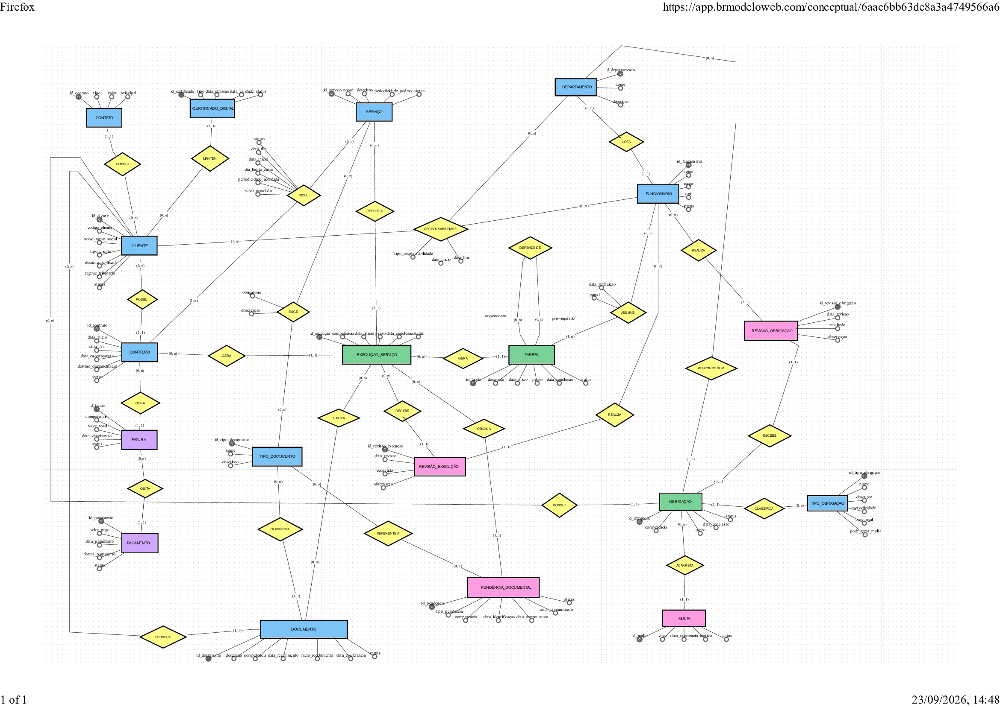

# Entrega 1 — Modelo Conceitual (DER)
### Modelagem de um sistema de gestão de informações para uma organização de pequeno porte

---

## Metadados

- **Nomes dos alunos e RGM**
  - Vinícius Dias Gomes — RGM: 47441081
  - Guilherme de Souza Lopes dos Santos — RGM: 47475609
  - Valquíria Rodrigues de Macedo — RGM: 47415061
  - Gabrielly Witai Pereira — RGM: 47396750
  - Pablo Henrique Lourenço Guimarães — RGM: 47672285

## 1. Caracterização da Organização

- **Nome e natureza da organização:** DML CONTABILIDADE LTDA., empresa privada com fins lucrativos do setor de serviços contábeis. Atua na escrituração contábil e fiscal, na assessoria empresarial e no planejamento tributário de pessoas físicas e jurídicas.

- **Contexto e porte:** organização com aproximadamente 50 anos de atuação, uma única unidade, 7 funcionários e cerca de 100 clientes ativos, entre pessoas físicas e empresas. A estrutura é dividida entre a diretoria e cargos técnicos (contadores e auxiliares), organizados por departamentos, além de um departamento administrativo e de relacionamento com clientes. O volume de atividades é predominantemente cíclico: serviços mensais, como folha de pagamento e apuração de impostos, e serviços anuais, como a entrega de declarações de imposto de renda de pessoa física. Os documentos chegam por captura automática no ERP contábil (Alterdata) mediante certificado digital A1, por e-mail, por WhatsApp corporativo ou fisicamente, na recepção ou por motoboy.

- **Problemas e necessidades identificados:** a organização não relatou dificuldade em localizar informações, por concentrá-las no ERP contábil e no servidor de arquivos. Os pontos frágeis estão no que não é registrado. Não há registro formal do recebimento de cada documento, nem rotina única de acompanhamento de tarefas: cada setor mantém controle próprio do que está pendente, em andamento ou concluído, e é também nesse controle setorial que se identifica um atraso. Os prazos das obrigações não são registrados em sistema, apenas conhecidos pelos setores, e não existe alerta de prazo próximo, embora o descumprimento gere multa para o cliente. O maior gerador de retrabalho apontado é a coleta de dados para o fechamento da folha de pagamento: as empresas demoram a enviar as informações e frequentemente as enviam com erro, obrigando o setor a refazer o trabalho. Parte dos controles vive fora do sistema, em planilhas Excel de conferência e de faturamento e em documentos Word de contratos.

- **Justificativa da escolha:** a organização foi escolhida por reunir três condições necessárias ao projeto. Primeiro, o acesso: o grupo obteve autorização para realizar a pesquisa de campo e entrevistar o responsável pela empresa. Segundo, o porte adequado, com processos suficientes para gerar um modelo rico — clientes, contratos, serviços, documentos, tarefas, obrigações e cobrança — sem a complexidade de uma organização de grande porte. Terceiro, a existência de lacunas reais de registro, que dão sentido prático à modelagem: o sistema proposto não duplicaria um controle já existente, mas passaria a registrar aquilo que hoje depende da memória e do controle informal de cada setor.

- **Evidências da organização:**
  - Razão social: DML CONTABILIDADE LTDA.
  - Responsável pela organização e contato fornecido ao grupo: **Deni Maricato Maciel — TEL (11) 98857-6266**
  - Levantamento realizado por meio de entrevista estruturada com o responsável, aplicada presencialmente, com registro das respostas no roteiro de perguntas anexado ao repositório.

---

## 2. Processos de Negócio

- **Principais processos mapeados:**

  **Cadastro de cliente.** A secretária do departamento administrativo e de relacionamento com clientes registra o novo cliente no sistema interno, com os dados cadastrais e fiscais da pessoa física ou da empresa. Cada cliente recebe um código de identificação interno, que é o elemento usado para vincular documentos ao cliente. Alterações societárias ou cadastrais disparam atualização do registro.

  **Contratação de serviços.** O cliente firma contrato com o escritório e, dentro dele, contrata um ou mais serviços. Valor e periodicidade são acordados por contrato, podendo variar entre clientes para o mesmo serviço. O contrato também fixa os prazos de entrega de documentos e de execução.

  **Recebimento e conferência de documentos.** Os documentos são capturados automaticamente no ERP por certificado digital, recebidos por e-mail ou WhatsApp, ou entregues fisicamente. São identificados pelo código do cliente e conferidos pelo departamento que executará o serviço relacionado. Quando falta documento ou o documento chega incorreto, o setor faz a cobrança ou avisa o cliente do erro.

  **Execução de serviço e distribuição de tarefas.** A cada competência, o serviço contratado gera uma execução. A execução é desdobrada em tarefas que percorrem os departamentos: recepção, conferência, ações específicas de cada setor, conferência final e retorno ao cliente com o serviço realizado. Uma tarefa pode depender da conclusão de outra, e uma mesma tarefa pode ter mais de um responsável.

  **Revisão.** Nenhum serviço é entregue sem conferência: todos os serviços são revisados dentro de seus departamentos, e o mesmo ocorre antes de uma obrigação ser considerada cumprida.

  **Controle de obrigações e prazos.** Cada obrigação é acompanhada pelo setor responsável, que detém o controle de prazo e entrega. Os prazos variam conforme a opção tributária de cada cliente e são definidos pelo contrato ou pela legislação. O descumprimento gera multa para a empresa.

  **Faturamento e cobrança.** A cobrança é eletrônica, por boleto bancário, com valores que variam conforme o cliente e os serviços contratados. Os pagamentos são registrados e há controle de pagamentos em atraso.

- **Fluxogramas:** não foram elaborados nesta entrega; os processos estão descritos textualmente acima e representados de forma estrutural no DER da Seção 7.

---

## 3. Requisitos do Sistema

### 3.1 Requisitos Funcionais

- **RF01 — Cadastrar clientes.** O sistema deve permitir registrar pessoas físicas e jurídicas, com código interno único, documento fiscal e, para empresas, o regime tributário.
- **RF02 — Registrar canais de contato.** O sistema deve permitir cadastrar os canais de comunicação de cada cliente (e-mail, telefone, WhatsApp) e indicar o canal preferencial.
- **RF03 — Controlar certificados digitais.** O sistema deve registrar os certificados digitais dos clientes e suas datas de validade.
- **RF04 — Registrar contratos e serviços contratados.** O sistema deve permitir registrar o contrato de cada cliente e os serviços nele incluídos, com valor acordado, periodicidade e dia limite de envio de documentos.
- **RF05 — Gerar e acompanhar execuções de serviço.** O sistema deve registrar a execução de cada serviço contratado por competência, com prazo, data de conclusão e situação.
- **RF06 — Registrar tarefas e responsáveis.** O sistema deve permitir desdobrar a execução em tarefas, atribuí-las a um ou mais funcionários e registrar dependência entre tarefas.
- **RF07 — Registrar o recebimento de documentos.** O sistema deve registrar cada documento recebido, seu tipo, sua competência, o meio de recebimento e a data de conferência.
- **RF08 — Registrar pendências documentais.** O sistema deve permitir registrar documento faltante ou incorreto, a data de identificação, a data e o canal da comunicação ao cliente e a situação da pendência.
- **RF09 — Controlar obrigações e prazos.** O sistema deve registrar as obrigações de cada cliente, com tipo, competência, prazo, setor responsável e situação.
- **RF10 — Registrar multas.** O sistema deve registrar as multas decorrentes do descumprimento de prazos, com valor, data e motivo.
- **RF11 — Registrar revisões.** O sistema deve registrar a revisão de execuções e de obrigações, com revisor, data e resultado.
- **RF12 — Emitir e controlar faturas.** O sistema deve permitir gerar a fatura do contrato por competência, com valor e vencimento, e registrar o pagamento correspondente.
- **RF13 — Consultar informações.** O sistema deve permitir consultar clientes, documentos, tarefas, obrigações e cobranças, e identificar itens vencidos sem conclusão.

### 3.2 Requisitos Não Funcionais

- **RNF01 — Integridade referencial.** O sistema deve impedir registros órfãos: toda execução deve pertencer a um contrato e a um serviço, toda tarefa a uma execução, toda fatura a um contrato.
- **RNF02 — Controle de acesso por papel.** O acesso deve respeitar a lotação do funcionário: o cadastro de clientes é atribuição do departamento administrativo e as informações financeiras não devem ser alteradas após o lançamento.
- **RNF03 — Rastreabilidade.** O sistema deve permitir identificar qual funcionário realizou cada alteração relevante, necessidade explicitada pela organização.
- **RNF04 — Preservação do histórico.** Clientes, contratos e funcionários encerrados devem ser inativados, nunca excluídos, preservando o histórico contábil e fiscal.
- **RNF05 — Desempenho de consulta.** As consultas por cliente, competência e prazo devem ser respondidas em tempo compatível com o uso diário, apoiadas por índices adequados.
- **RNF06 — Disponibilidade e backup.** As informações devem estar sujeitas a rotina de backup, prática já adotada pela organização.
- **RNF07 — Conformidade com a LGPD.** O tratamento dos dados pessoais deve limitar-se às finalidades contratual e legal, com acesso restrito e registro de acesso.
- **RNF08 — Usabilidade.** A interface deve ser operável por usuários sem formação em tecnologia, refletindo o perfil da equipe da organização.

---

## 4. Regras de Negócio

- **Regras operacionais:**

  - **RN01.** Todo cliente deve possuir cadastro no sistema interno antes de qualquer serviço ser executado.
  - **RN02.** Cada cliente possui um código de identificação interno único, usado para vincular documentos ao cliente.
  - **RN03.** O cadastro e a alteração de clientes são atribuição da secretária do departamento administrativo e de relacionamento com clientes.
  - **RN04.** Um cliente pode contratar mais de um serviço, e o valor de um mesmo serviço pode variar de cliente para cliente.
  - **RN05.** Cada cliente tem, ao menos, um responsável dentro do escritório, e cada departamento tem um responsável por sua área; um funcionário pode responder por vários clientes.
  - **RN06.** Todo funcionário está lotado em um único departamento.
  - **RN07.** Toda tarefa possui ao menos um responsável, e um mesmo serviço pode envolver mais de um funcionário.
  - **RN08.** Uma tarefa só pode ser iniciada após a conclusão das tarefas das quais depende.
  - **RN09.** Nenhum serviço é considerado concluído antes de ser revisado dentro do departamento; a mesma regra vale para as obrigações.
  - **RN10.** Determinados serviços exigem tipos específicos de documento, e a ausência de documento obrigatório impede a execução.
  - **RN11.** Documento faltante ou incorreto gera pendência documental, comunicada ao cliente.
  - **RN12.** Os prazos são definidos pelo contrato ou pela legislação e podem variar conforme a opção tributária do cliente.
  - **RN13.** O descumprimento de prazo de obrigação pode gerar multa para o cliente.
  - **RN14.** A cobrança é feita por fatura emitida a partir do contrato e quitada exclusivamente por boleto bancário.
  - **RN15.** Uma tarefa, execução ou obrigação é considerada atrasada quando o prazo está vencido e a conclusão não foi registrada.
  - **RN16.** Encerrado o contrato, a documentação é entregue ao novo responsável técnico ou ao proprietário da empresa, e o registro do destino é mantido.

- **Restrições organizacionais:**

  - **RO01 — Guarda legal de documentos.** A atividade contábil está sujeita a prazos legais de guarda de documentos fiscais e trabalhistas. Isso importa ao modelo porque nenhuma entidade admite exclusão física: encerramentos são representados por data de encerramento e indicador de inatividade.
  - **RO02 — Informações financeiras não editáveis.** A organização informou que ninguém altera informações financeiras. Isso importa porque o modelo separa FATURA de PAGAMENTO: uma correção é um novo registro, não a edição do anterior.
  - **RO03 — Restrição de cadastro.** Apenas o departamento administrativo cadastra ou altera clientes, o que exige que o modelo saiba a que departamento cada funcionário pertence.
  - **RO04 — Rastreabilidade de alterações.** A organização considera importante saber qual funcionário realizou determinada alteração, o que exige identificação individual de acesso.
  - **RO05 — Dependência de documentos de terceiros.** A execução depende de documentos enviados pelo cliente, fora do controle do escritório. Isso importa porque a pendência documental precisa ser uma entidade própria, e não um simples estado da execução.
  - **RO06 — Uma única unidade.** A organização possui uma só unidade, o que dispensa entidade de filial no modelo.

---

## 5. Dicionário de Dados Conceitual (Preliminar)

O dicionário de dados conceitual foi elaborado em formato HTML, contendo as entidades, atributos, descrições e regras de negócio associadas ao modelo.

**[Acessar o Dicionário de Dados em HTML](docs/dicionario_dados.html)**

---

## 6. Modelagem Conceitual (Entidades, Atributos, Relacionamentos)

- **Entidades reconhecidas:**

  - **CLIENTE** — pessoa física ou jurídica atendida; é o eixo do modelo, pois documentos, contratos e obrigações partem dele.
  - **CONTATO** — canais de comunicação do cliente; separado porque um cliente tem vários canais e a comunicação de pendências depende deles.
  - **CERTIFICADO_DIGITAL** — certificado que viabiliza a captura automática de documentos; tem validade própria, que precisa ser acompanhada.
  - **CONTRATO** — instrumento que vincula cliente e escritório, com vigência e encerramento.
  - **SERVICO** — catálogo de serviços oferecidos, com periodicidade padrão.
  - **EXECUCAO_SERVICO** — ocorrência de um serviço em uma competência; é o que permite falar em prazo e conclusão.
  - **TAREFA** — etapa departamental da execução, com responsáveis e dependência entre etapas.
  - **REVISAO_EXECUCAO** — conferência obrigatória antes da entrega do serviço.
  - **DEPARTAMENTO** — setor que concentra rotinas e prazos; é a unidade organizacional efetiva.
  - **FUNCIONARIO** — pessoa que executa tarefas, revisa e responde por clientes; concentra também a identificação de acesso.
  - **TIPO_DOCUMENTO** — classificação dos documentos recebidos.
  - **DOCUMENTO** — peça enviada pelo cliente e consumida na execução.
  - **PENDENCIA_DOCUMENTAL** — registro de falta ou erro de documento, com a cobrança feita ao cliente.
  - **TIPO_OBRIGACAO** — catálogo de obrigações, com base legal e periodicidade.
  - **OBRIGACAO** — dever concreto de um cliente em uma competência, com prazo e setor responsável.
  - **MULTA** — penalidade decorrente do descumprimento de prazo.
  - **REVISAO_OBRIGACAO** — conferência antes de considerar a obrigação cumprida.
  - **FATURA** — cobrança periódica emitida a partir do contrato.
  - **PAGAMENTO** — quitação da fatura por boleto bancário.

- **Atributos e classificações:** cada entidade reúne atributos de identificação (identificadores e códigos), de caracterização (nomes, tipos e descrições), de temporalidade (datas de início, prazo, conclusão, validade e vencimento) e de situação (indicadores de estado). Os atributos de cada entidade estão detalhados na Seção 5. Três relacionamentos possuem atributos próprios: **INCLUI** (valor e periodicidade acordados, dia limite de envio), **ASSUME** (papel e data de atribuição) e **RESPONSABILIDADE** (tipo de responsabilidade e período).

- **Relacionamentos pertinentes:** o cliente possui contatos, certificados, contratos, documentos e obrigações. O contrato inclui serviços — relacionamento N:M com atributos — e gera faturas, quitadas por pagamentos. A execução de serviço vincula-se ao contrato e ao serviço, gera tarefas, consome documentos (N:M) e origina pendências documentais. A tarefa é assumida por funcionários (N:M) e depende recursivamente de outras tarefas. O departamento lota funcionários e responde por obrigações. A responsabilidade sobre o cliente é um relacionamento ternário entre cliente, funcionário e departamento. Execuções e obrigações recebem revisões realizadas por funcionários.

- **Restrições e políticas organizacionais aplicadas ao modelo:** a inexistência de exclusão física (encerramentos são registrados por data e indicador de situação); a impossibilidade de alterar lançamentos financeiros, que leva a tratar correções como novos registros; a restrição de cadastro ao departamento administrativo, que exige a lotação do funcionário no modelo; a rastreabilidade de alterações, atendida pela identificação de acesso do funcionário; e a existência de uma única unidade, que dispensa entidade de filial.

---

## 7. Diagrama Entidade-Relacionamento (DER)

O diagrama utiliza a notação brasileira (Heuser): retângulos representam entidades, losangos representam relacionamentos, elipses representam atributos com o identificador sublinhado, e a cardinalidade é expressa em pares **(mín,máx)** posicionados junto à entidade a que se referem. Linhas tracejadas indicam relacionamentos roteados para reduzir cruzamentos, com a mesma semântica das linhas contínuas.

O modelo representa 19 entidades, seus atributos, os relacionamentos entre elas e as cardinalidades mínimas e máximas de cada participação, incluindo um relacionamento ternário (RESPONSABILIDADE), um relacionamento recursivo (DEPENDE_DE, entre tarefas) e três relacionamentos N:M com atributos próprios (INCLUI, EXIGE e ASSUME).

A escalabilidade está prevista na separação entre catálogo e ocorrência — SERVICO e EXECUCAO_SERVICO, TIPO_OBRIGACAO e OBRIGACAO, TIPO_DOCUMENTO e DOCUMENTO — que permite acrescentar novos serviços, obrigações e tipos de documento sem alterar a estrutura. A integração com as próximas etapas está preparada pela normalização das datas de prazo e conclusão, que sustentam os controles de atraso e os futuros alertas de vencimento.

---

## 8. Justificativa Técnica

**Por que separar SERVICO de EXECUCAO_SERVICO.** O serviço é o que o escritório oferece; a execução é o que ele faz em uma competência. Guardar prazo e conclusão no próprio serviço impediria registrar a folha de janeiro e a de fevereiro como fatos distintos. A separação é o que dá sentido ao controle de prazos, hoje mantido informalmente por cada setor. A mesma razão levou a separar TIPO_OBRIGACAO de OBRIGACAO e TIPO_DOCUMENTO de DOCUMENTO.

**Por que INCLUI é um relacionamento com atributos e não uma entidade.** O valor e a periodicidade não pertencem ao contrato nem ao serviço isoladamente: existem apenas na combinação dos dois, porque um mesmo serviço custa valores diferentes para clientes diferentes. Um relacionamento N:M com atributos expressa exatamente isso. Uma entidade associativa foi considerada e descartada por não acrescentar identidade própria ao fato — a execução, que precisava dela, passou a referenciar diretamente CONTRATO e SERVICO.

**Por que PENDENCIA_DOCUMENTAL é entidade e não um estado do documento.** A pendência mais frequente relatada é a do documento que não chegou. Um documento inexistente não pode carregar um estado; a falta precisa existir como registro próprio, com data de identificação, canal de comunicação e situação. É esse registro que dá tratamento ao maior gerador de retrabalho apontado pela organização.

**Por que a pendência se liga à execução, e não ao cliente.** O cliente é alcançável por execução → contrato → cliente. Um vínculo direto criaria dois caminhos para o mesmo fato e abriria espaço para inconsistência, sem ganho de informação.

**Por que a cardinalidade mínima importa.** O par (mín,máx) distingue o que é obrigatório do que é opcional, algo que a notação de Chen não mostra. Registrar que CLIENTE participa de RESPONSABILIDADE com (1,n) é declarar a regra de que nenhum cliente fica sem responsável; registrar DT_CONCLUSAO como opcional é declarar que a execução existe antes de terminar.

**Por que o atraso não é atributo.** Armazenar "atrasado" como estado exigiria atualizar todos os registros diariamente e conviveria com dados desatualizados. Atraso é condição derivada de prazo vencido sem conclusão registrada, o que mantém o modelo consistente por construção.

**Por que a revisão foi dividida em duas entidades.** REVISAO_EXECUCAO e REVISAO_OBRIGACAO revisam objetos diferentes. Uma entidade única exigiria um vínculo polimórfico, que o SGBD não consegue validar por integridade referencial. Duas entidades custam um retângulo a mais e garantem a consistência.

**Por que o acesso ficou em FUNCIONARIO.** Uma entidade separada de usuário só se justifica quando há acessos que não correspondem a pessoas da organização, o que não é o caso: são 7 funcionários, todos lotados em departamentos. O login como atributo do funcionário resolve a identificação sem criar uma entidade de relacionamento 1:1.

**Por que a fatura pertence ao contrato.** O valor cobrado nasce dos serviços incluídos no contrato. Ligar a fatura ao contrato preserva esse caminho e evita um vínculo redundante com o cliente. A limitação assumida é que a fatura registra o valor total e não a composição por serviço; se a organização passar a discriminar os serviços no boleto, será necessário reintroduzir uma entidade de item de fatura.

**Por que DEPENDE_DE é recursivo.** A organização descreveu que um departamento assume o serviço depois que outro conclui sua etapa. Como as duas pontas da relação são tarefas, o relacionamento é da entidade com ela mesma, com papéis distintos: tarefa dependente e pré-requisito.

---

## 9. Uso de Inteligência Artificial
*

| Item | O que registrar |
|------|------------------|
| **Ferramenta e etapa** | Claude (Anthropic). Usada em três etapas: (a) redesenho do DER a partir do diagrama elaborado pelo grupo no draw.io, primeiro na notação de Peter Chen e depois na notação brasileira; (b) análise crítica do modelo contra as respostas da entrevista, para identificar inconsistências e lacunas; (c) estruturação deste README e do dicionário de dados em HTML. |
| **Motivação** | (a) Padronizar graficamente o diagrama e garantir que as cardinalidades estivessem expressas corretamente na notação exigida; (b) confrontar o modelo com o levantamento de campo, verificando se cada resposta da entrevista tinha lugar no modelo; (c) organizar a documentação conforme o esqueleto e o exemplo de dicionário fornecidos pela disciplina. |
| **Prompt(s) utilizados** | "Com base neste diagrama entidade relacionamento feito no draw.io, você consegue criar uma imagem deste modelo de DER usando o modelo de Peter Chen"; "certo, gere um usando a notação brasileira"; "com base neste documento que contém a base para o dicionário de dados e no arquivo de imagem que eu lhe enviei, busque por inconsistências e liste as soluções para mim"; "certo, revise os seguintes termos: Contrato de Serviço não precisa existir, Pendência Documental não precisa se relacionar duplamente ao cliente, fatura pode estar diretamente ligado ao contrato, a relação Responde_por entre o departamento e a tarefa não precisa existir, os atributos de Usuário devem estar diretamente relacionados ao funcionário, a entidade Perfil não precisa existir, nem o Log"; "use o esqueleto como base e gere o README e um arquivo HTML com o dicionário de dados seguindo o exemplo fornecido". |
| **Resposta recebida** | A ferramenta produziu as imagens do DER nas duas notações; apontou inconsistências entre o modelo e as respostas da entrevista (pendência documental sem vínculo com o cliente, fatura sem discriminação por serviço, ausência de registro de certificado digital, de canais de contato, de multa e de rastreabilidade de alterações); sugeriu entidades adicionais; e redigiu as seções deste README e a estrutura do dicionário de dados. |
| **Fontes consultadas e verificadas** | A ferramenta não foi usada como fonte de informação sobre a organização. Todos os dados sobre a DML CONTABILIDADE LTDA. vieram da entrevista aplicada pelo grupo. Cada afirmação incorporada ao texto foi conferida contra o roteiro de perguntas respondido pela empresa; afirmações que não encontravam respaldo nas respostas foram removidas. |
| **Trechos rejeitados ou corrigidos** | O grupo rejeitou boa parte das entidades propostas na versão intermediária do modelo. Foram descartadas as entidades USUARIO, PERFIL, LOG_ALTERACAO, CONTRATO_SERVICO e ITEM_FATURA, além do relacionamento entre DEPARTAMENTO e TAREFA e do vínculo direto entre PENDENCIA_DOCUMENTAL e CLIENTE. O motivo foi a complexidade desproporcional ao porte da organização e a duplicidade de caminhos entre as mesmas entidades. Os atributos de acesso foram transferidos para FUNCIONARIO. |
| **Justificativa da escolha final** | O modelo mantido é o que representa os processos efetivamente observados com o menor número de entidades. As sugestões aceitas foram as que corrigiam lacunas concretas do levantamento — certificado digital, canais de contato, multa, prazo de envio de documentos e registro de conferência. As rejeitadas foram as que anteciparam necessidades ainda não manifestadas pela organização. |
| **Reflexão crítica** | A principal limitação observada foi a tendência da ferramenta a ampliar o modelo, propondo entidades de controle de acesso e auditoria que atendiam a boas práticas genéricas, mas não a uma necessidade declarada por uma empresa de 7 pessoas. Houve também interpretações inferidas a partir do diagrama original, em pontos em que as linhas do desenho eram ambíguas, o que exigiu verificação manual pelo grupo. O uso mais proveitoso foi o de confronto entre o modelo e o roteiro de entrevista, que revelou respostas do levantamento sem representação no DER. |

---

## Resumo dos Pesos

| Dimensão | Peso total |
|----------|-----------|
| Conceitual (contexto, requisitos/regras, modelagem, justificativa técnica) | 30% |
| Procedimental (requisitos, fluxogramas, dicionário de dados, DER) | 50% |
| Atitudinal (participação, comprometimento, colaboração, autonomia) | 20% |

**Entrega final:** README.md completo + DER + Dicionário de Dados em HTML (com exceção dos cursos GTI) anexado no repositório GitHub do grupo.
