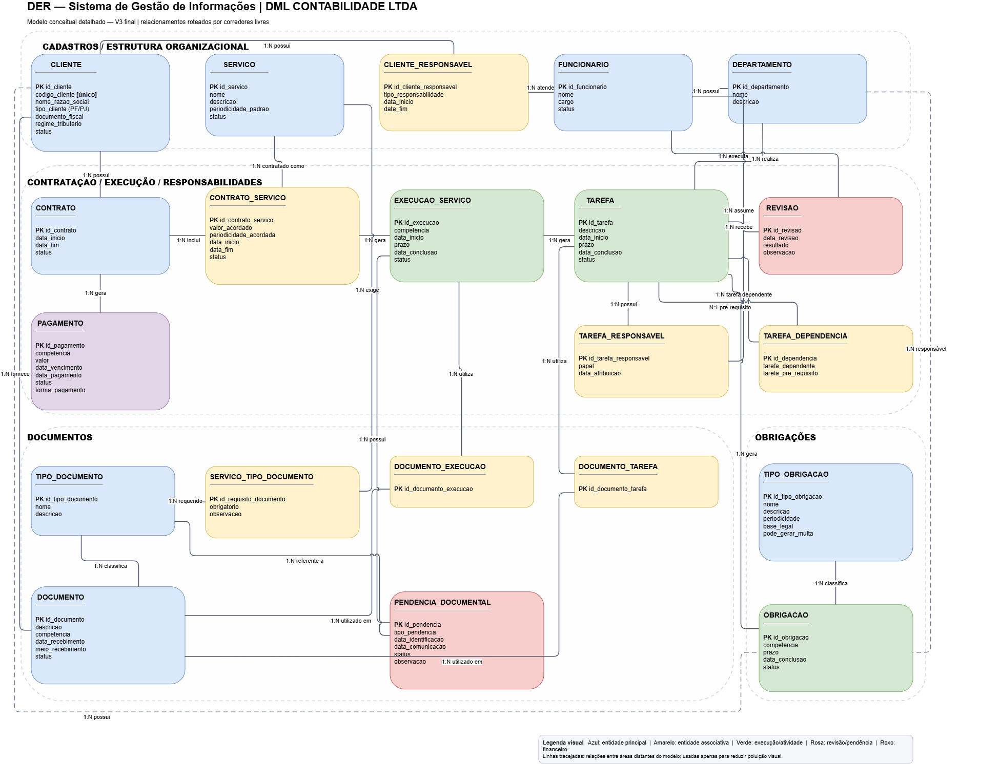

# Sistema de Gestão de Informações - DML CONTABILIDADE LTDA.

## Nome dos Integrantes do Projeto:

* Vinícius Dias Gomes - RGM: 47441081
* Guilherme de Souza Lopes dos Santos - RGM: 47475609
* Valquíria Rodrigues de Macedo - RGM: 47415061
* Gabrielly Witai Pereira - RGM: 47396750
* Pablo Henrique Lourenço Guimarães - RGM: 47672285

## Introdução

### Contextualização do Problema

A gestão de informações é uma atividade importante para organizações que precisam manter dados de clientes, serviços e atividades administrativas de forma organizada e consistente. Em uma empresa do setor contábil, a quantidade de informações relacionadas aos clientes e aos serviços prestados torna necessário compreender como esses dados se relacionam.

A DML CONTABILIDADE LTDA. é uma organização do ramo contábil que possui aproximadamente 50 anos de atuação e atende cerca de 100 clientes, entre pessoas físicas e empresas. A organização possui atualmente 7 funcionários e oferece serviços de contabilidade, assessoria empresarial e planejamento tributário.

A partir das informações obtidas por meio de pesquisa de campo, foi realizada a identificação dos principais elementos envolvidos na organização das informações da empresa, com o objetivo de desenvolver um modelo conceitual de dados adequado à realidade observada.

### Objetivos

O objetivo geral deste projeto é desenvolver um modelo conceitual de dados para representar as principais informações e relações existentes na DML CONTABILIDADE LTDA., utilizando como base as informações obtidas durante o levantamento realizado com a organização.

Como objetivos específicos, pretende-se:

* Identificar as principais entidades relacionadas aos processos da organização;
* Identificar os atributos relevantes para cada entidade;
* Identificar os relacionamentos existentes entre as entidades;
* Identificar regras de negócio e restrições relevantes;
* Elaborar um Diagrama Entidade-Relacionamento (DER) representando a estrutura conceitual dos dados;
* Documentar e justificar as decisões adotadas na modelagem.

### Delimitação

O projeto está delimitado à elaboração do modelo conceitual de dados da DML CONTABILIDADE LTDA., considerando as informações obtidas durante o levantamento realizado com a organização.

O trabalho contempla a identificação de entidades, atributos, relacionamentos, regras de negócio e demais elementos necessários para a construção do modelo conceitual.

Neste momento, o projeto não contempla a implementação física de um banco de dados ou o desenvolvimento de um sistema computacional completo.

---

# Desenvolvimento

## Caracterização da Organização

A organização selecionada para o desenvolvimento do projeto é a **DML CONTABILIDADE LTDA.**, uma empresa do segmento de contabilidade.

Com base nas informações levantadas durante a pesquisa de campo, foram identificadas as seguintes características:

| Característica                    | Informação                                                      |
| --------------------------------- | --------------------------------------------------------------- |
| Organização                       | DML CONTABILIDADE LTDA.                                         |
| Tempo de existência               | Aproximadamente 50 anos                                         |
| Quantidade de funcionários        | 7 funcionários                                                  |
| Quantidade aproximada de clientes | 100 clientes                                                    |
| Unidades                          | 1 unidade                                                       |
| Público atendido                  | Pessoas físicas e empresas                                      |
| Principais serviços               | Contabilidade, assessoria empresarial e planejamento tributário |

A estrutura funcional informada é composta por uma área de diretoria e por profissionais responsáveis pelas atividades técnicas, incluindo contadores e auxiliares.

A organização também possui um departamento administrativo e de relacionamento com clientes, sendo a secretária desse departamento responsável pelo cadastro de novos clientes no sistema de controle interno.

---

## Processos de Negócio

A partir das informações obtidas na pesquisa de campo, foi identificado como processo relevante o **cadastro de novos clientes**.

O processo inicia-se quando um novo cliente passa a utilizar os serviços da organização. As informações necessárias são registradas no sistema de controle interno da empresa. O cadastro é realizado pela secretária do departamento administrativo e de relacionamento com clientes.

Também foi identificado que um mesmo cliente pode contratar mais de um serviço oferecido pela organização.

Os principais serviços informados pela organização são:

* Contabilidade;
* Assessoria empresarial;
* Planejamento tributário.

O processo e suas etapas poderão ser detalhados posteriormente conforme informações complementares obtidas junto à organização.

---

## Requisitos do Sistema

Os requisitos apresentados nesta seção representam, em nível conceitual, as necessidades identificadas a partir do levantamento realizado.

### Requisitos Funcionais

**RF01 - Cadastrar clientes**

O sistema deverá permitir o registro dos dados dos clientes da organização.

**RF02 - Consultar clientes**

O sistema deverá permitir a consulta dos clientes cadastrados.

**RF03 - Registrar serviços**

O sistema deverá permitir o registro dos serviços oferecidos pela organização.

**RF04 - Associar clientes aos serviços**

O sistema deverá permitir relacionar um cliente aos serviços que ele contrata.

**RF05 - Manter informações dos clientes**

O sistema deverá possibilitar a manutenção das informações cadastrais dos clientes.

> Os requisitos funcionais poderão ser refinados após a análise das informações complementares obtidas na pesquisa de campo e da versão definitiva do modelo conceitual.

### Requisitos Não Funcionais

**RNF01 - Organização dos dados**

As informações deverão ser organizadas de maneira estruturada, permitindo a identificação das relações existentes entre clientes e serviços.

**RNF02 - Integridade das informações**

Os dados registrados deverão manter consistência entre as entidades e seus respectivos relacionamentos.

**RNF03 - Controle de acesso**

As informações do sistema deverão possuir acesso controlado de acordo com as responsabilidades dos usuários da organização.

**RNF04 - Facilidade de consulta**

As informações cadastradas deverão ser estruturadas de forma que possam ser consultadas de maneira eficiente.

> Os requisitos não funcionais apresentados são preliminares e poderão ser ajustados conforme o aprofundamento do levantamento realizado junto à organização.

---

## Regras de Negócio

Com base nas informações levantadas, foram identificadas inicialmente as seguintes regras de negócio:

**RN01 - Cadastro de clientes**

Todo novo cliente da organização deve possuir um cadastro no sistema de controle interno.

**RN02 - Responsável pelo cadastro**

O cadastro de novos clientes é realizado pela secretária do departamento administrativo e de relacionamento com clientes.

**RN03 - Tipos de clientes**

A organização atende tanto pessoas físicas quanto empresas.

**RN04 - Contratação de serviços**

Um cliente pode contratar mais de um serviço oferecido pela organização.

**RN05 - Serviços oferecidos**

A organização oferece serviços de contabilidade, assessoria empresarial e planejamento tributário.

**RN06 - Identificação dos dados**

O cadastro do cliente deve conter os dados empresariais ou cadastrais necessários para a identificação e atendimento do cliente pela organização.

As regras poderão ser ampliadas ou modificadas após a análise das respostas complementares da entrevista.

---

# Dicionário de Dados Conceitual

O dicionário de dados apresenta os principais elementos identificados na modelagem conceitual, descrevendo as entidades e seus respectivos atributos. Como o projeto se encontra na etapa de modelagem conceitual, os tipos de dados apresentados possuem caráter preliminar e deverão ser validados conforme a versão definitiva do DER.

## Entidade: Cliente

Representa as pessoas físicas ou empresas que possuem relacionamento com a DML CONTABILIDADE LTDA.

| Atributo     | Tipo conceitual | Obrigatório | Descrição                                                 |
| ------------ | --------------- | ----------- | --------------------------------------------------------- |
| ID_Cliente   | Identificador   | Sim         | Identificação única do cliente no sistema                 |
| Nome         | Texto           | Sim         | Nome completo da pessoa física ou razão social da empresa |
| Tipo_Cliente | Categórico      | Sim         | Indica se o cliente é pessoa física ou empresa            |
| CPF_CNPJ     | Identificador   | Sim         | Documento utilizado para identificação do cliente         |
| Telefone     | Texto           | Não         | Número de telefone para contato com o cliente             |
| E-mail       | Texto           | Não         | Endereço de e-mail utilizado para comunicação             |
| Endereço     | Texto           | Não         | Endereço cadastrado para o cliente                        |

> Os atributos acima são preliminares. Os campos definitivos deverão ser confirmados a partir das informações fornecidas pela organização e da estrutura final do DER.

## Entidade: Serviço

Representa os serviços disponibilizados pela DML CONTABILIDADE LTDA.

| Atributo     | Tipo conceitual | Obrigatório | Descrição                                              |
| ------------ | --------------- | ----------- | ------------------------------------------------------ |
| ID_Servico   | Identificador   | Sim         | Identificação única do serviço                         |
| Nome_Servico | Texto           | Sim         | Nome do serviço oferecido                              |
| Descrição    | Texto           | Não         | Descrição das características ou finalidade do serviço |

Os principais serviços identificados durante o levantamento são:

* Contabilidade;
* Assessoria empresarial;
* Planejamento tributário.

## Entidade: Contratação

Representa a associação entre um cliente e um serviço contratado.

| Atributo         | Tipo conceitual | Obrigatório | Descrição                                          |
| ---------------- | --------------- | ----------- | -------------------------------------------------- |
| ID_Contratacao   | Identificador   | Sim         | Identificação única da contratação                 |
| ID_Cliente       | Referência      | Sim         | Identificação do cliente relacionado à contratação |
| ID_Servico       | Referência      | Sim         | Identificação do serviço contratado                |
| Data_Contratacao | Data            | Não         | Data em que o serviço foi contratado               |
| Status           | Categórico      | Não         | Situação atual da contratação                      |

A entidade **Contratação** é considerada na modelagem devido à regra de negócio segundo a qual um cliente pode contratar mais de um serviço.

### Observação sobre o dicionário

O dicionário de dados apresentado possui caráter **preliminar**, pois a definição final dos atributos deve estar alinhada ao DER definitivo e às informações completas obtidas durante o levantamento.

A inclusão, exclusão ou alteração de atributos poderá ocorrer após a validação da modelagem pelo grupo.

---

## Modelagem Conceitual

A modelagem conceitual tem como objetivo representar os principais dados envolvidos na organização e os relacionamentos existentes entre eles, sem se preocupar, neste momento, com detalhes específicos de implementação em um Sistema Gerenciador de Banco de Dados.

Com base nas informações levantadas inicialmente, foram identificados como elementos relevantes:

### Entidades

As entidades consideradas inicialmente para a modelagem são:

* **Cliente**: representa as pessoas físicas ou empresas atendidas pela organização.
* **Serviço**: representa os serviços oferecidos pela DML CONTABILIDADE LTDA.
* **Contratação**: representa a relação entre o cliente e o serviço contratado.

### Atributos

Os atributos representam as características utilizadas para descrever cada entidade.

A entidade **Cliente** possui atributos relacionados à identificação e aos dados cadastrais do cliente.

A entidade **Serviço** possui atributos relacionados à identificação e à descrição dos serviços oferecidos pela organização.

A entidade **Contratação** possui atributos relacionados à associação entre o cliente e o serviço contratado.

### Relacionamentos

O principal relacionamento identificado é a associação entre **Cliente** e **Serviço** por meio da **Contratação**, considerando que um cliente pode contratar mais de um serviço.

A definição definitiva das cardinalidades deverá ser validada de acordo com o DER desenvolvido pelo grupo e com as regras de negócio levantadas.

---

## Diagrama Entidade-Relacionamento (DER)

O Diagrama Entidade-Relacionamento (DER) foi elaborado com base nas informações levantadas durante a pesquisa de campo realizada na **DML Contabilidade LTDA.**

O diagrama representa, de forma gráfica, as principais entidades, atributos, relacionamentos e cardinalidades identificados para a organização, considerando as informações obtidas durante a pesquisa.

O DER está disponibilizado no repositório em dois formatos:

* **Imagem (PNG):** utilizada para visualização do diagrama diretamente no README.
* **Arquivo Draw.io:** arquivo editável utilizado para a elaboração do diagrama.

### DER

**Arquivo editável:** [DER.drawio](docs/DER/DER_DML_CONTABILIDADE.drawio)

---

## Justificativa Técnica

A modelagem conceitual foi desenvolvida buscando representar os principais elementos relacionados à gestão das informações da DML CONTABILIDADE LTDA.

A entidade **Cliente** permite representar as pessoas físicas e empresas atendidas pela organização, enquanto a entidade **Serviço** representa os serviços disponibilizados pela empresa.

A entidade **Contratação** representa a associação entre clientes e serviços, permitindo registrar quais serviços estão relacionados a cada cliente. Essa estrutura considera a informação levantada de que um mesmo cliente pode contratar mais de um serviço.

A separação entre clientes, serviços e contratações contribui para uma organização mais estruturada das informações e evita a necessidade de armazenar repetidamente os dados de um cliente para cada serviço contratado.

A definição das entidades, atributos e relacionamentos foi baseada nas informações obtidas durante a pesquisa de campo, buscando representar os processos identificados na organização.

As decisões de modelagem poderão ser refinadas após a validação do DER elaborado pelo grupo e a obtenção de informações complementares.

---

## Uso de Inteligência Artificial

A Inteligência Artificial foi utilizada como ferramenta de apoio durante o desenvolvimento do projeto.

Seu uso teve como finalidade auxiliar na organização das informações levantadas, na interpretação dos requisitos da atividade, na estruturação da documentação, na elaboração preliminar do dicionário de dados e na revisão da modelagem conceitual.

As informações referentes à organização foram obtidas por meio da pesquisa de campo realizada pelo grupo. A Inteligência Artificial não foi utilizada como fonte primária para as informações específicas da DML CONTABILIDADE LTDA.

A utilização da ferramenta ocorreu como apoio ao processo de desenvolvimento, sendo as informações e decisões do projeto analisadas e validadas pelos integrantes do grupo.

---

# Conclusão

O desenvolvimento deste projeto permitiu realizar o levantamento inicial das informações relacionadas à DML CONTABILIDADE LTDA. e utilizá-las como base para a construção de um modelo conceitual de dados.

A partir da pesquisa de campo, foi possível identificar características da organização, seus principais serviços, o processo de cadastro de clientes e algumas regras relacionadas à contratação dos serviços.

O modelo conceitual busca representar essas informações de maneira estruturada, facilitando a compreensão dos dados e dos relacionamentos existentes na organização.

O dicionário de dados complementa a modelagem ao apresentar uma descrição dos principais elementos e atributos considerados no modelo.

A modelagem apresentada poderá ser refinada conforme novas informações sejam obtidas e conforme a validação do DER desenvolvido pelo grupo.

---

# Referências Bibliográficas

**DML CONTABILIDADE LTDA.** Informações obtidas por meio de pesquisa de campo e entrevista realizada pelos integrantes do grupo. 2026.

**ELMASRI, Ramez; NAVATHE, Shamkant B.** Sistemas de Banco de Dados. Pearson.

**HEUSER, Carlos Alberto.** Projeto de Banco de Dados. Bookman.
